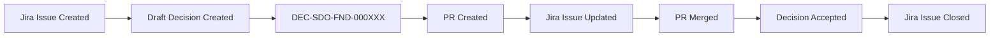

# SPEC-000046: ProvenanceCode Monorepo-Aware Naming Convention Standard v2.0

## Status
Draft

## Version
2.0.0

## Summary
This specification defines an enhanced naming convention for ProvenanceCode artifacts that supports monorepo architectures, project/subproject hierarchies, and seamless Jira integration while maintaining full backward compatibility with the existing standard.

---

## Table of Contents
1. [Background](#background)
2. [Naming Convention Format](#naming-convention-format)
3. [Artifact Type Codes](#artifact-type-codes)
4. [Project and Subproject Codes](#project-and-subproject-codes)
5. [Sequence Numbers](#sequence-numbers)
6. [URI Reference Format](#uri-reference-format)
7. [Backward Compatibility](#backward-compatibility)
8. [Jira Integration](#jira-integration)
9. [Monorepo Support](#monorepo-support)
10. [Migration Path](#migration-path)
11. [Examples](#examples)
12. [Schema Updates](#schema-updates)
13. [Validation Rules](#validation-rules)

---

## Background

### Problem Statement
The current ProvenanceCode standard uses a simple format: `{TYPE}-{SEQUENCE}` (e.g., `DEC-000001`). While this works well for single-project repositories, it presents challenges for:

1. **Monorepo Architectures**: Cannot distinguish which workspace/project an artifact belongs to
2. **Jira Integration**: Limited ability to map artifacts to Jira project keys and components
3. **Cross-Project References**: Difficult to track artifact dependencies across projects
4. **Organizational Scalability**: No hierarchical organization for large enterprises
5. **Namespace Collisions**: Risk of duplicate IDs across different projects in the same organization

### Goals
- Enable hierarchical project organization (project → subproject → artifact)
- Support monorepo workspace identification
- Facilitate Jira integration with project and component mapping
- Maintain full backward compatibility with existing artifacts
- Provide clear migration path for existing repositories

---

## Naming Convention Format

### Version 2.0 Format (Extended)
```
{ARTIFACT_TYPE}-{PROJECT_CODE}-{SUBPROJECT_CODE}-{SEQUENCE}
```

**Components:**
- `{ARTIFACT_TYPE}`: 2-4 letter artifact type code (e.g., DEC, SPEC, RA, MR)
- `{PROJECT_CODE}`: 2-4 letter project identifier (e.g., SDO, PQS, AUTH)
- `{SUBPROJECT_CODE}`: 2-4 letter subproject/workspace identifier (e.g., FND, API, UI)
- `{SEQUENCE}`: 6-digit zero-padded sequence number (e.g., 000001)

**Examples:**
```
DEC-SDO-FND-000001    (Decision in System Demo / Foundation)
SPEC-PQS-API-000042   (Spec in PlantQuest / API)
RA-AUTH-SEC-000007    (Risk Acceptance in Auth / Security)
MR-PQS-FE-000003      (Mistake Record in PlantQuest / Frontend)
```

### Version 1.0 Format (Legacy - Still Supported)
```
{ARTIFACT_TYPE}-{SEQUENCE}
```

**Examples:**
```
DEC-000001
SPEC-000045
RA-000001
MR-000001
```

### Format Selection
- **New Projects**: SHOULD use v2.0 format
- **Monorepos**: MUST use v2.0 format
- **Single Projects**: MAY use v1.0 or v2.0 format
- **Existing Projects**: MAY migrate to v2.0 or continue with v1.0

---

## Artifact Type Codes

### Standard Artifact Types

| Code | Full Name | Description | Directory |
|------|-----------|-------------|-----------|
| `DEC` | Decision | Architectural and technical decisions | `/provenance/decisions/` |
| `SPEC` | Specification | Requirements and specifications | `/provenance/specs/` |
| `RA` | Risk Acceptance | Documented risk acceptances | `/provenance/risks/` |
| `MR` | Mistake Record | Post-mortem mistake documentation | `/provenance/mistakes/` |

### Extended Artifact Types (Optional)

| Code | Full Name | Description | Directory |
|------|-----------|-------------|-----------|
| `ADR` | Architecture Decision Record | Alias for DEC, ADR-standard compatible | `/provenance/decisions/` |
| `REQ` | Requirement | Detailed requirement specifications | `/provenance/requirements/` |
| `TEST` | Test Strategy | Test plan and strategy documents | `/provenance/tests/` |
| `SEC` | Security Review | Security assessment documents | `/provenance/security/` |
| `PERF` | Performance Review | Performance analysis documents | `/provenance/performance/` |

### Custom Artifact Types
Organizations MAY define custom artifact types following these rules:
- Code MUST be 2-4 uppercase letters
- Code MUST NOT conflict with standard types
- Code MUST be documented in `/provenance/config.json`

**Example Custom Type Configuration:**
```json
{
  "customArtifactTypes": {
    "COMP": {
      "name": "Compliance Review",
      "path": "/provenance/compliance",
      "schema": "compliance.schema.json"
    }
  }
}
```

---

## Project and Subproject Codes

### Project Code Guidelines

**Format Rules:**
- Length: 2-4 uppercase letters
- Pattern: `^[A-Z]{2,4}$`
- MUST be unique within the organization
- SHOULD be meaningful and memorable

**Recommended Project Code Patterns:**

1. **Acronym-Based** (Preferred for clarity)
   ```
   SDO = System Demo
   PQS = PlantQuest System
   AUTH = Authentication Service
   PAY = Payment Gateway
   ```

2. **Abbreviated Name**
   ```
   CORE = Core Platform
   API = API Gateway
   UI = User Interface Layer
   ```

3. **Product Code**
   ```
   PRD = Production System
   STG = Staging Environment
   ```

### Subproject Code Guidelines

**Format Rules:**
- Length: 2-4 uppercase letters or numbers
- Pattern: `^[A-Z0-9]{2,4}$`
- MUST be unique within the project
- SHOULD indicate workspace or component

**Recommended Subproject Code Patterns:**

1. **Workspace-Based** (Monorepo)
   ```
   FND = Frontend (pqs-frontend → PFD)
   API = API Service
   CLI = Command Line Tools
   SDK = Software Development Kit
   ```

2. **Component-Based**
   ```
   AUTH = Authentication Module
   PAY = Payment Module
   UI = User Interface
   DB = Database Layer
   ```

3. **Layer-Based**
   ```
   CORE = Core Logic
   SVC = Services
   CTRL = Controllers
   MDL = Models
   ```

### Code Registry

Projects SHOULD maintain a code registry in `/provenance/codes.json`:

```json
{
  "schema": "provenancecode.codes@1.0",
  "projects": {
    "SDO": {
      "name": "System Demo",
      "description": "Main system demonstration project",
      "jiraProject": "SDO",
      "subprojects": {
        "FND": {
          "name": "Foundation",
          "workspace": "pqs-frontend",
          "description": "Frontend foundation workspace",
          "jiraComponent": "Frontend"
        },
        "API": {
          "name": "API Services",
          "workspace": "pqs-api",
          "description": "Backend API services",
          "jiraComponent": "API"
        }
      }
    },
    "PQS": {
      "name": "PlantQuest",
      "description": "PlantQuest system",
      "jiraProject": "PQS",
      "subprojects": {
        "FE": {
          "name": "Frontend",
          "workspace": "pqs-frontend",
          "jiraComponent": "Frontend"
        },
        "BE": {
          "name": "Backend",
          "workspace": "pqs-backend",
          "jiraComponent": "Backend"
        }
      }
    }
  }
}
```

---

## Sequence Numbers

### Format
- 6 digits, zero-padded
- Range: `000001` to `999999`
- Sequential within each `{ARTIFACT_TYPE}-{PROJECT}-{SUBPROJECT}` namespace

### Sequencing Strategies

#### Per-Namespace Sequencing (Recommended for v2.0)
```
DEC-SDO-FND-000001
DEC-SDO-FND-000002
DEC-SDO-API-000001  ← Separate sequence for different subproject
DEC-SDO-API-000002
```

#### Global Sequencing (Legacy v1.0)
```
DEC-000001
DEC-000002
SPEC-000001  ← Separate sequence per artifact type
SPEC-000002
```

### Sequence Management

**Automated Sequence Assignment:**
Projects SHOULD use automated tooling to assign sequence numbers:

```bash
# Create new decision
npm run provenance:create decision --project SDO --subproject FND
# Output: Created DEC-SDO-FND-000015
```

**Manual Sequence Assignment:**
When creating artifacts manually:
1. Check the highest existing sequence number in the namespace
2. Increment by 1
3. Zero-pad to 6 digits

**Sequence Registry:**
Maintain current sequences in `/provenance/sequences.json`:

```json
{
  "schema": "provenancecode.sequences@1.0",
  "namespaces": {
    "DEC-SDO-FND": {
      "current": 14,
      "next": 15,
      "lastUpdated": "2026-02-16T10:30:00Z"
    },
    "SPEC-PQS-API": {
      "current": 42,
      "next": 43,
      "lastUpdated": "2026-02-15T14:22:00Z"
    }
  }
}
```

---

## URI Reference Format

### Internal References (Same Repository)

**v2.0 Format:**
```
{ARTIFACT_TYPE}-{PROJECT}-{SUBPROJECT}-{SEQUENCE}
```

**v1.0 Format:**
```
{ARTIFACT_TYPE}-{SEQUENCE}
```

**Examples:**
```json
{
  "relatedDecisions": [
    "DEC-SDO-FND-000001",
    "DEC-PQS-API-000042"
  ]
}
```

### Cross-Repository References

**ProvenanceCode URI Format:**
```
pc://{org}/{repo}/{artifact_type}/{ARTIFACT_ID}
```

**v2.0 Examples:**
```
pc://plantquest/pqs-platform/decision/DEC-SDO-FND-000001
pc://plantquest/pqs-platform/spec/SPEC-PQS-API-000042
pc://acme/auth-service/risk/RA-AUTH-SEC-000007
```

**v1.0 Examples (Still Valid):**
```
pc://provenancecode/provenancecode-github/decision/DEC-000124
pc://provenancecode/provenancecode-github/spec/SPEC-000045
```

### URL References (GitHub, Jira, etc.)

**GitHub Issue/PR:**
```
https://github.com/org/repo/issues/123
https://github.com/org/repo/pull/456
```

**Jira Ticket:**
```
https://company.atlassian.net/browse/SDO-789
https://company.atlassian.net/browse/PQS-123
```

---

## Backward Compatibility

### Compatibility Guarantees

1. **Schema Validation**: All v1.0 artifacts remain valid under v2.0 schemas
2. **Tooling Support**: All tooling MUST support both v1.0 and v2.0 formats
3. **Reference Resolution**: Mixed v1.0 and v2.0 references are supported
4. **URI Format**: v1.0 URI format remains valid indefinitely

### Mixed Format Repositories

Repositories MAY contain both v1.0 and v2.0 artifacts:

```
/provenance/
  /decisions/
    /DEC-000001/              ← v1.0 format
    /DEC-000002/              ← v1.0 format
    /DEC-SDO-FND-000001/      ← v2.0 format
    /DEC-SDO-API-000001/      ← v2.0 format
```

### Cross-Format References

Artifacts MAY reference both v1.0 and v2.0 artifacts:

```json
{
  "decision_id": "DEC-SDO-FND-000001",
  "relatedDecisions": [
    "DEC-000124",              // v1.0 reference
    "DEC-SDO-API-000042"       // v2.0 reference
  ]
}
```

---

## Jira Integration

### Jira Project Mapping

**Project Code → Jira Project Key**

The project code in the artifact ID CAN map directly to a Jira project key:

```
DEC-SDO-FND-000001 → Jira Project: SDO
SPEC-PQS-API-000042 → Jira Project: PQS
RA-AUTH-SEC-000007 → Jira Project: AUTH
```

**Configuration:**
```json
{
  "jiraIntegration": {
    "enabled": true,
    "projectMapping": {
      "SDO": {
        "jiraProject": "SDO",
        "jiraUrl": "https://company.atlassian.net/browse/SDO"
      },
      "PQS": {
        "jiraProject": "PQS",
        "jiraUrl": "https://company.atlassian.net/browse/PQS"
      }
    }
  }
}
```

### Jira Component Mapping

**Subproject Code → Jira Component**

The subproject code CAN map to a Jira component:

```
DEC-SDO-FND-000001 → Jira Component: Frontend (FND)
DEC-SDO-API-000001 → Jira Component: API (API)
```

### Jira Custom Fields

**ProvenanceCode Integration Fields:**

Organizations SHOULD create these custom fields in Jira:

| Field Name | Field Type | Description | Example |
|------------|-----------|-------------|---------|
| `Provenance ID` | Text (single line) | ProvenanceCode artifact ID | DEC-SDO-FND-000001 |
| `Provenance URI` | URL | Full ProvenanceCode URI | pc://org/repo/decision/DEC-SDO-FND-000001 |
| `Provenance Artifact Hash` | Text (single line) | SHA-256 hash of artifact | abc123... |
| `Provenance Commit SHA` | Text (single line) | Git commit containing artifact | def456... |
| `Provenance Status` | Select | Artifact status | draft, accepted, superseded |

### Jira Workflow Integration

**Artifact Lifecycle Sync:**



**Example Workflow:**
1. Developer creates Jira ticket: `SDO-123`
2. Developer creates decision draft: `DEC-SDO-FND-000015`
3. Decision references Jira ticket in `links.issues`
4. PR created with decision
5. Jira ticket updated with `Provenance ID` custom field
6. PR merged → Decision status becomes `accepted`
7. Jira ticket updated with artifact hash and commit SHA
8. Jira ticket closed

### Jira Search and Reporting

**JQL Queries:**

```jql
# Find all issues with ProvenanceCode decisions
"Provenance ID" ~ "DEC-*"

# Find all decisions in SDO project
"Provenance ID" ~ "DEC-SDO-*"

# Find all frontend decisions
"Provenance ID" ~ "DEC-SDO-FND-*"

# Find all risk acceptances
"Provenance ID" ~ "RA-*"
```

---

## Monorepo Support

### Workspace Identification

For monorepo projects, the subproject code identifies the workspace:

**Example Monorepo Structure:**
```
/
├── pqs-frontend/           ← Subproject: FND or FE
├── pqs-api/                ← Subproject: API or BE
├── pqs-cli/                ← Subproject: CLI
├── pqs-sdk/                ← Subproject: SDK
└── provenance/
    ├── decisions/
    │   ├── DEC-PQS-FE-000001/    ← Frontend decision
    │   ├── DEC-PQS-BE-000001/    ← Backend decision
    │   └── DEC-PQS-CLI-000001/   ← CLI decision
    └── codes.json                ← Code registry
```

### Workspace Configuration

**In `/provenance/codes.json`:**
```json
{
  "schema": "provenancecode.codes@1.0",
  "monorepo": true,
  "rootWorkspace": ".",
  "projects": {
    "PQS": {
      "name": "PlantQuest System",
      "jiraProject": "PQS",
      "subprojects": {
        "FE": {
          "name": "Frontend",
          "workspace": "pqs-frontend",
          "paths": ["pqs-frontend/**"],
          "jiraComponent": "Frontend"
        },
        "BE": {
          "name": "Backend",
          "workspace": "pqs-api",
          "paths": ["pqs-api/**"],
          "jiraComponent": "Backend"
        },
        "CLI": {
          "name": "CLI Tools",
          "workspace": "pqs-cli",
          "paths": ["pqs-cli/**"],
          "jiraComponent": "CLI"
        }
      }
    }
  }
}
```

### Path-Based Artifact Requirements

**Automatic Workspace Detection:**

When changes are made to specific paths, require artifacts for that workspace:

```json
{
  "requireDecisionOnPaths": {
    "pqs-frontend/**": {
      "project": "PQS",
      "subproject": "FE",
      "artifactPattern": "DEC-PQS-FE-*"
    },
    "pqs-api/**": {
      "project": "PQS",
      "subproject": "BE",
      "artifactPattern": "DEC-PQS-BE-*"
    }
  }
}
```

### Cross-Workspace Dependencies

When a change affects multiple workspaces:

**Option 1: Multiple Artifacts (Recommended)**
```
DEC-PQS-FE-000015  ← Frontend decision
DEC-PQS-BE-000042  ← Backend decision (references FE-000015)
```

**Option 2: Shared Artifact**
```
DEC-PQS-CORE-000001  ← Core/shared decision affecting multiple workspaces
```

---

## Migration Path

### Migration Strategies

#### Strategy 1: Gradual Migration (Recommended)
- Continue using v1.0 for existing artifacts
- Use v2.0 for all new artifacts
- Update v1.0 artifacts only when modified

#### Strategy 2: Bulk Migration
- Convert all existing artifacts to v2.0
- Update all references
- Maintain redirect mapping from v1.0 to v2.0 IDs

#### Strategy 3: Hybrid Approach
- Keep v1.0 for historical artifacts (closed/archived)
- Migrate active artifacts to v2.0
- Use v2.0 for all new artifacts

### Migration Tools

**Automated Migration Script:**

```bash
# Migrate specific artifact
npm run provenance:migrate DEC-000001 --project SDO --subproject FND

# Bulk migrate all decisions
npm run provenance:migrate-all --type decision --project PQS --subproject FE

# Generate migration report
npm run provenance:migration-report
```

**Migration Configuration:**

```json
{
  "migration": {
    "strategy": "gradual",
    "defaultProject": "PQS",
    "subprojectMapping": {
      "src/frontend": "FE",
      "src/api": "BE",
      "src/cli": "CLI"
    },
    "preserveV1Ids": true,
    "createRedirects": true
  }
}
```

### Migration Checklist

- [ ] Define project and subproject codes
- [ ] Create `/provenance/codes.json` registry
- [ ] Update `/provenance/config.json` with v2.0 configuration
- [ ] Update CI/CD validation to support v2.0 format
- [ ] Document project-specific naming conventions
- [ ] Train team on new format
- [ ] Migrate active artifacts (if bulk migration)
- [ ] Update tooling and automation
- [ ] Update documentation and templates

---

## Examples

### Example 1: Simple Project (v1.0 → v2.0 Comparison)

**v1.0 Format (Legacy):**
```
/provenance/
  /decisions/
    /DEC-000001/
      decision.json
```

**v2.0 Format (New):**
```
/provenance/
  /decisions/
    /DEC-MYAPP-CORE-000001/
      decision.json
```

### Example 2: Monorepo Project

**Directory Structure:**
```
/
├── frontend/
├── backend/
├── mobile/
└── provenance/
    ├── codes.json
    ├── decisions/
    │   ├── DEC-SHOP-FE-000001/
    │   ├── DEC-SHOP-BE-000001/
    │   └── DEC-SHOP-MOB-000001/
    ├── specs/
    │   ├── SPEC-SHOP-FE-000001/
    │   └── SPEC-SHOP-BE-000001/
    └── risks/
        └── RA-SHOP-BE-000001/
```

**codes.json:**
```json
{
  "schema": "provenancecode.codes@1.0",
  "monorepo": true,
  "projects": {
    "SHOP": {
      "name": "E-Commerce Shop",
      "jiraProject": "SHOP",
      "subprojects": {
        "FE": {
          "name": "Frontend",
          "workspace": "frontend",
          "paths": ["frontend/**"]
        },
        "BE": {
          "name": "Backend",
          "workspace": "backend",
          "paths": ["backend/**"]
        },
        "MOB": {
          "name": "Mobile",
          "workspace": "mobile",
          "paths": ["mobile/**"]
        }
      }
    }
  }
}
```

### Example 3: Enterprise Multi-Project Organization

**Organization: ACME Corp**

**Project Structure:**
```
- AUTH (Authentication Platform)
  - CORE (Core Auth Service)
  - API (Auth API)
  - UI (Auth UI)
  
- PAY (Payment Platform)
  - PROC (Payment Processor)
  - GTW (Gateway)
  - HOOK (Webhooks)
  
- USER (User Management)
  - PROF (Profile Service)
  - PREF (Preferences)
  - NOTIF (Notifications)
```

**Artifact Examples:**
```
DEC-AUTH-CORE-000001    Authentication decision
DEC-AUTH-API-000042     Auth API decision
SPEC-PAY-PROC-000015    Payment processor spec
RA-PAY-GTW-000003       Payment gateway risk
MR-USER-PROF-000001     User profile mistake
```

### Example 4: Decision Record with Jira Integration

**DEC-SDO-FND-000001/decision.json:**
```json
{
  "schema": "provenancecode.decision.v2",
  "decision_id": "DEC-SDO-FND-000001",
  "repo": {
    "org": "plantquest",
    "name": "pqs-platform"
  },
  "ref": "pc://plantquest/pqs-platform/decision/DEC-SDO-FND-000001",
  "project": {
    "code": "SDO",
    "name": "System Demo",
    "jiraProject": "SDO"
  },
  "subproject": {
    "code": "FND",
    "name": "Foundation",
    "workspace": "pqs-frontend",
    "jiraComponent": "Frontend"
  },
  "title": "Adopt Vue 2.x for frontend compatibility",
  "status": "accepted",
  "context": {
    "problem": "Need to maintain compatibility with existing Vue 2.x ecosystem",
    "constraints": [
      "Cannot use Vue 3.x Composition API",
      "Must use Promise-based async operations"
    ]
  },
  "decision": "Use Vue 2.x Options API with Promise-based async operations",
  "consequences": "Team must avoid Vue 3.x features and async/await syntax",
  "links": {
    "pr": "https://github.com/plantquest/pqs-platform/pull/123",
    "issues": [
      "https://company.atlassian.net/browse/SDO-456",
      "https://company.atlassian.net/browse/SDO-457"
    ],
    "specs": [
      "SPEC-SDO-FND-000001"
    ]
  },
  "risk": {
    "score": 2,
    "rationale": "Low risk - well-established framework with strong ecosystem support"
  },
  "review": {
    "human": "@tech-lead"
  },
  "metadata": {
    "created_at": "2026-02-16T10:00:00Z",
    "updated_at": "2026-02-16T14:30:00Z",
    "version": "1.0.0"
  }
}
```

### Example 5: Spec with Cross-Project References

**SPEC-PQS-API-000042/spec.json:**
```json
{
  "id": "SPEC-PQS-API-000042",
  "repo": {
    "org": "plantquest",
    "name": "pqs-platform"
  },
  "ref": "pc://plantquest/pqs-platform/spec/SPEC-PQS-API-000042",
  "project": {
    "code": "PQS",
    "name": "PlantQuest",
    "jiraProject": "PQS"
  },
  "subproject": {
    "code": "API",
    "name": "API Services",
    "workspace": "pqs-api",
    "jiraComponent": "API"
  },
  "title": "RESTful API design for plant data endpoints",
  "status": "approved",
  "risk": "medium",
  "acceptanceCriteria": [
    "All endpoints follow RESTful conventions",
    "Authentication required for all endpoints",
    "Rate limiting implemented",
    "API versioning in place"
  ],
  "affectedPaths": [
    "pqs-api/src/controllers/",
    "pqs-api/src/routes/",
    "pqs-api/tests/"
  ],
  "relatedDecisions": [
    "DEC-PQS-API-000015",
    "DEC-AUTH-API-000003",
    "pc://acme/auth-service/decision/DEC-AUTH-CORE-000007"
  ],
  "relatedSpecs": [
    "SPEC-PQS-API-000041"
  ],
  "links": {
    "jira": "https://company.atlassian.net/browse/PQS-789"
  }
}
```

---

## Schema Updates

### Updated Decision Schema (v2.0)

**Key Changes:**
1. `decision_id` pattern updated to support both v1.0 and v2.0
2. Added optional `project` and `subproject` metadata
3. Updated `ref` pattern to support v2.0 format
4. Added `metadata` section for versioning

**Pattern Updates:**
```json
{
  "decision_id": {
    "type": "string",
    "pattern": "^(DEC-\\d{6}|DEC-[A-Z]{2,4}-[A-Z0-9]{2,4}-\\d{6})$"
  },
  "ref": {
    "type": "string",
    "pattern": "^pc:\\/\\/[a-z0-9-]+\\/[a-z0-9-]+\\/decision\\/(DEC-\\d{6}|DEC-[A-Z]{2,4}-[A-Z0-9]{2,4}-\\d{6})$"
  },
  "project": {
    "type": "object",
    "properties": {
      "code": {
        "type": "string",
        "pattern": "^[A-Z]{2,4}$"
      },
      "name": {
        "type": "string"
      },
      "jiraProject": {
        "type": "string"
      }
    }
  },
  "subproject": {
    "type": "object",
    "properties": {
      "code": {
        "type": "string",
        "pattern": "^[A-Z0-9]{2,4}$"
      },
      "name": {
        "type": "string"
      },
      "workspace": {
        "type": "string"
      },
      "jiraComponent": {
        "type": "string"
      }
    }
  }
}
```

### Updated Spec Schema (v2.0)

Similar updates as decision schema:
```json
{
  "id": {
    "type": "string",
    "pattern": "^(SPEC-\\d{6}|SPEC-[A-Z]{2,4}-[A-Z0-9]{2,4}-\\d{6})$"
  }
}
```

### Updated Risk Schema (v2.0)

```json
{
  "ra_id": {
    "type": "string",
    "pattern": "^(RA-\\d{6}|RA-[A-Z]{2,4}-[A-Z0-9]{2,4}-\\d{6})$"
  }
}
```

### Updated Mistake Schema (v2.0)

```json
{
  "mr_id": {
    "type": "string",
    "pattern": "^(MR-\\d{6}|MR-[A-Z]{2,4}-[A-Z0-9]{2,4}-\\d{6})$"
  }
}
```

### Reference Pattern Updates

**All artifact references MUST accept both formats:**

```json
{
  "relatedDecisions": {
    "type": "array",
    "items": {
      "anyOf": [
        {
          "type": "string",
          "pattern": "^DEC-\\d{6}$"
        },
        {
          "type": "string",
          "pattern": "^DEC-[A-Z]{2,4}-[A-Z0-9]{2,4}-\\d{6}$"
        },
        {
          "type": "string",
          "pattern": "^pc:\\/\\/[a-z0-9-]+\\/[a-z0-9-]+\\/decision\\/(DEC-\\d{6}|DEC-[A-Z]{2,4}-[A-Z0-9]{2,4}-\\d{6})$"
        }
      ]
    }
  }
}
```

---

## Validation Rules

### ID Format Validation

**v1.0 Format:**
```regex
^(DEC|SPEC|RA|MR)-\d{6}$
```

**v2.0 Format:**
```regex
^(DEC|SPEC|RA|MR|[A-Z]{2,4})-[A-Z]{2,4}-[A-Z0-9]{2,4}-\d{6}$
```

**Combined Pattern:**
```regex
^(DEC|SPEC|RA|MR|[A-Z]{2,4})-(\d{6}|[A-Z]{2,4}-[A-Z0-9]{2,4}-\d{6})$
```

### Directory Name Validation

The directory name MUST match the artifact ID:

**Valid:**
```
/provenance/decisions/DEC-000001/
/provenance/decisions/DEC-SDO-FND-000001/
/provenance/specs/SPEC-PQS-API-000042/
```

**Invalid:**
```
/provenance/decisions/DEC-SDO-FND-001/     ← Wrong sequence length
/provenance/decisions/dec-sdo-fnd-000001/  ← Lowercase
/provenance/decisions/DEC-SDO_FND-000001/  ← Wrong separator
```

### Code Registry Validation

When using v2.0 format, project and subproject codes MUST be defined in `/provenance/codes.json`:

```javascript
// Validation pseudo-code
function validateArtifactId(id, codesRegistry) {
  const match = id.match(/^([A-Z]{2,4})-([A-Z]{2,4})-([A-Z0-9]{2,4})-\d{6}$/);
  if (!match) return true; // v1.0 format, skip project validation
  
  const [_, artifactType, projectCode, subprojectCode] = match;
  
  if (!codesRegistry.projects[projectCode]) {
    throw new Error(`Unknown project code: ${projectCode}`);
  }
  
  if (!codesRegistry.projects[projectCode].subprojects[subprojectCode]) {
    throw new Error(`Unknown subproject code: ${subprojectCode} in project ${projectCode}`);
  }
  
  return true;
}
```

### Reference Validation

All artifact references MUST:
1. Match valid ID pattern (v1.0 or v2.0)
2. Point to existing artifacts (for same-repo references)
3. Use valid ProvenanceCode URI format (for cross-repo references)

### Jira Integration Validation

When Jira integration is enabled:
1. Project code SHOULD map to valid Jira project
2. Subproject code SHOULD map to valid Jira component
3. Jira custom fields SHOULD be populated

---

## Implementation Checklist

### For Repository Maintainers

- [ ] Decide on v1.0 vs v2.0 format strategy
- [ ] Create `/provenance/codes.json` if using v2.0
- [ ] Update `/provenance/config.json` with project settings
- [ ] Update CI/CD validation scripts
- [ ] Create artifact creation templates/scripts
- [ ] Document project-specific naming conventions
- [ ] Train team on new format
- [ ] Update PR template to reference format

### For Tool Developers

- [ ] Update schema validation to support both formats
- [ ] Update artifact creation tools
- [ ] Update reference resolution logic
- [ ] Update search and indexing
- [ ] Create migration tools
- [ ] Update documentation generators
- [ ] Test with mixed v1.0/v2.0 repositories

### For Integration Developers

- [ ] Update Jira integration to use project/subproject mapping
- [ ] Create custom Jira fields
- [ ] Update webhook handlers
- [ ] Update sync logic
- [ ] Test cross-platform references
- [ ] Document integration setup

---

## References

- ProvenanceCode v1.0 Standard: `/provenance/schema/`
- Jira Integration Guide: (To be created)
- Monorepo Configuration: `/docs/MONOREPO_GUIDE.md`
- Migration Tools: `/scripts/provenance/migrate.js`

---

## Changelog

### Version 2.0.0 (2026-02-16)
- Initial v2.0 specification
- Added project and subproject code support
- Added Jira integration patterns
- Added monorepo support
- Defined backward compatibility rules
- Created migration strategies

---

## License
ISC

---

## Authors
- ProvenanceCode Team
- Contributors: (See CONTRIBUTING.md)
